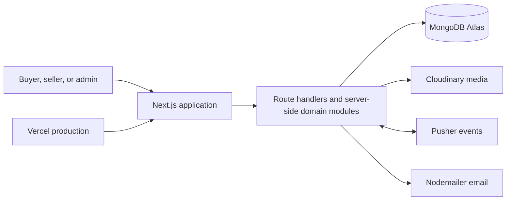

# NorzaMart

<p align="center">
  <strong>A neighborhood-first grocery marketplace for Norzagaray, Bulacan.</strong>
</p>

<p align="center">
  Fresh produce, pantry staples, and everyday essentials from verified local sellers—brought together in one modern marketplace.
</p>

<p align="center">
  <a href="https://norzamart.vercel.app/"><strong>Visit the live marketplace →</strong></a>
</p>

<p align="center">
  
  
  
  
  
  
</p>


## About the project

NorzaMart is a full-stack, multi-vendor e-commerce platform designed around the communities of Norzagaray. Buyers can discover nearby products and stores, place multi-seller orders, save favorites, and communicate with sellers. Sellers receive dedicated tools for inventory, fulfillment, analytics, and payouts, while administrators manage the marketplace from a separate control center.

The interface follows the **“Neighborhood market, refined”** design direction: warm local-market character, clear commerce hierarchy, accessible controls, and responsive layouts for mobile, tablet, and desktop.

## Marketplace highlights

### For buyers

- Search products and local stores by category, barangay, price, rating, and freshness.
- Browse featured products, local deals, nearby sellers, and barangay-based recommendations.
- Add products from multiple sellers to one cart and check out in a single flow.
- Save wishlist items, follow stores, review products, and manage delivery addresses.
- View orders, coupons, notifications, and recently viewed products from a buyer dashboard.
- Start buyer-seller conversations with unread counts and real-time updates.

### For sellers

- Create and manage products, prices, categories, images, and stock levels.
- Process orders through controlled marketplace status transitions.
- Confirm payments, resolve order issues, and request payouts.
- Review sales and inventory analytics from a dedicated seller dashboard.
- Manage store details and communicate directly with customers.

### For administrators

- Review sellers, products, users, orders, reviews, and payout requests.
- Manage categories, barangays, coupons, announcements, and subscribers.
- Monitor marketplace statistics and operational activity.
- Enforce role-based access and protected admin actions.

## Reliability and safeguards

- Credentials-based authentication with NextAuth.js, JWT sessions, and bcrypt password hashing.
- Role and ownership checks for buyer, seller, and administrator operations.
- Checkout validation, stock restoration, idempotency protection, and guarded order-state transitions.
- Coupon rules for expiry, usage limits, minimum spend, and maximum discounts.
- Safe structured-data serialization and security headers configured for production.
- Responsive 44px minimum touch targets, keyboard focus states, and reduced-motion support.

## Tech stack

| Area | Technology |
| --- | --- |
| Framework | Next.js 16 App Router |
| UI | React 19, TypeScript, Tailwind CSS 4, Framer Motion |
| Server | Next.js Route Handlers and server components |
| Database | MongoDB Atlas and Mongoose |
| Authentication | NextAuth.js credentials provider and JWT sessions |
| Media | Cloudinary |
| Real-time events | Pusher and Pusher JS |
| Email | Nodemailer with Gmail app passwords |
| Testing | Vitest, Testing Library, and JSDOM |
| Hosting | Vercel |

## Architecture



## Project structure

```text
norzamart/
├── app/                 # Pages, layouts, dashboards, and API route handlers
├── components/          # Storefront, commerce, account, and shared UI components
├── components/ui/       # Reusable product cards, dialogs, and NorzaMart icons
├── design-system/       # Brand tokens, responsive rules, and page specifications
├── lib/                 # Auth, database, models, validation, and domain logic
├── public/              # Static assets
├── types/               # Shared TypeScript declarations
├── proxy.ts             # Route protection and maintenance-mode routing
└── vitest.config.mts    # Test configuration
```

Tests are colocated with the routes and domain modules they cover.

## Getting started

### Prerequisites

- Node.js 20 or newer
- npm
- MongoDB Atlas database
- Cloudinary account
- Pusher Channels app
- Gmail account with an app password for transactional email

### 1. Clone and install

```bash
git clone https://github.com/anjhonhulguin02-blip/norzamart.git
cd norzamart
npm install
```

### 2. Configure the environment

Copy the example file:

```bash
cp .env.example .env.local
```

On PowerShell, use:

```powershell
Copy-Item .env.example .env.local
```

Fill in the following values without committing `.env.local`:

| Variable | Purpose |
| --- | --- |
| `MONGODB_URI` | MongoDB Atlas connection string |
| `NEXTAUTH_URL` | Local or production application URL |
| `NEXTAUTH_SECRET` | Secret used to sign and encrypt authentication sessions |
| `CLOUDINARY_CLOUD_NAME` | Cloudinary cloud name |
| `CLOUDINARY_API_KEY` | Cloudinary API key |
| `CLOUDINARY_API_SECRET` | Cloudinary API secret |
| `PUSHER_APP_ID` | Pusher application ID |
| `NEXT_PUBLIC_PUSHER_KEY` | Public Pusher application key |
| `PUSHER_SECRET` | Pusher server secret |
| `NEXT_PUBLIC_PUSHER_CLUSTER` | Pusher cluster region |
| `GMAIL_USER` | Gmail address used for transactional email |
| `GMAIL_APP_PASSWORD` | Gmail app password—not the account password |
| `MAINTENANCE_MODE` | Set to `true` to route the site to the maintenance page |

### 3. Start development

```bash
npm run dev
```

Open [http://localhost:3000](http://localhost:3000).

## Available scripts

| Command | Description |
| --- | --- |
| `npm run dev` | Start the local Next.js development server |
| `npm run build` | Create an optimized production build |
| `npm start` | Run the production build locally |
| `npm test` | Run the complete Vitest suite once |
| `npm run test:watch` | Run tests in watch mode |
| `npm run lint` | Run ESLint across the project |
| `npx tsc --noEmit` | Validate TypeScript without emitting files |

The latest release was verified with **15 passing test files, 96 passing tests, and a successful production TypeScript build**.

## Deployment

NorzaMart is deployed on Vercel at [norzamart.vercel.app](https://norzamart.vercel.app/).

For another Vercel project:

1. Import this GitHub repository into Vercel.
2. Add every variable from `.env.example` to the project environment settings.
3. Set `NEXTAUTH_URL` to the production domain.
4. Deploy from the `main` branch.

## Current payment scope

NorzaMart currently supports cash-on-delivery and manually confirmed payment workflows. Marketplace payout records are reviewed by administrators; automatic bank or wallet transfers are not yet enabled.

## Roadmap

- Integrate a Philippine payment gateway and automated payment reconciliation.
- Add automatic seller payout transfers after administrative approval.
- Expand seller analytics and operational reporting.
- Continue reducing the repository-wide lint backlog.

## Design documentation

The repository includes the NorzaMart design system in [`design-system/norzamart/MASTER.md`](design-system/norzamart/MASTER.md), covering brand colors, typography, spacing, responsive behavior, components, accessibility, and interaction rules.

---

Built for local commerce in **Norzagaray, Bulacan**.
